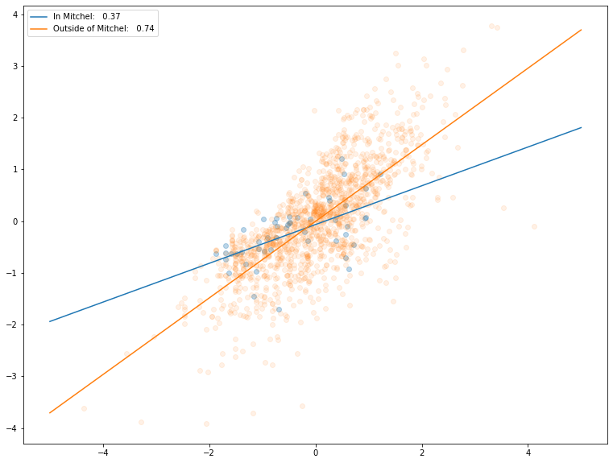

# Interactions - Lab

## Introduction

In this lab, you'll explore interactions in the Ames Housing dataset.

## Objectives

You will be able to:
- Implement interaction terms in Python using the `sklearn` and `statsmodels` packages 
- Interpret interaction variables in the context of a real-world problem 

## Build a baseline model 

You'll use a couple of built-in functions, which we imported for you below: 


```python
from sklearn.linear_model import LinearRegression
from sklearn.model_selection import cross_val_score
from sklearn.model_selection import KFold
import pandas as pd
import numpy as np
import matplotlib.pyplot as plt
```


```python
# __SOLUTION__ 
from sklearn.linear_model import LinearRegression
from sklearn.model_selection import cross_val_score
from sklearn.model_selection import KFold
import pandas as pd
import numpy as np
import matplotlib.pyplot as plt
```

If you still want to build a model in the end, you can do that, but this lab will just focus on finding meaningful insights in interactions and how they can improve $R^2$ values.


```python
regression = LinearRegression()
```


```python
# __SOLUTION__ 
regression = LinearRegression()
```

Create a baseline model which includes all the variables we selected from the Ames housing data set to predict the house prices. Then use 10-fold cross-validation and report the mean $R^2$ value as the baseline $R^2$.


```python
ames = pd.read_csv('ames.csv')

continuous = ['LotArea', '1stFlrSF', 'GrLivArea', 'SalePrice']
categoricals = ['BldgType', 'KitchenQual', 'SaleType', 'MSZoning', 'Street', 'Neighborhood']

## code here
```


```python
# __SOLUTION__ 
ames = pd.read_csv('ames.csv')

continuous = ['LotArea', '1stFlrSF', 'GrLivArea', 'SalePrice']
categoricals = ['BldgType', 'KitchenQual', 'SaleType', 'MSZoning', 'Street', 'Neighborhood']

ames_cont = ames[continuous]

# log features
log_names = [f'{column}_log' for column in ames_cont.columns]

ames_log = np.log(ames_cont)
ames_log.columns = log_names

# normalize (subract mean and divide by std)

def normalize(feature):
    return (feature - feature.mean()) / feature.std()

ames_log_norm = ames_log.apply(normalize)

# one hot encode categoricals
ames_ohe = pd.get_dummies(ames[categoricals], prefix=categoricals)

preprocessed = pd.concat([ames_log_norm, ames_ohe], axis=1)

X = preprocessed.drop('SalePrice_log', axis=1)
y = preprocessed['SalePrice_log']

crossvalidation = KFold(n_splits=10, shuffle=True, random_state=1)
baseline = np.mean(cross_val_score(regression, X, y, scoring='r2', cv=crossvalidation))

baseline
```


    0.8174620047489951


## See how interactions improve your baseline

Next, create all possible combinations of interactions, loop over them and add them to the baseline model one by one to see how they affect the $R^2$. We'll look at the 3 interactions which have the biggest effect on our $R^2$, so print out the top 3 combinations.

You will create a `for` loop to loop through all the combinations of 2 predictors. You can use `combinations` from itertools to create a list of all the pairwise combinations. To find more info on how this is done, have a look [here](https://docs.python.org/2/library/itertools.html).

Since there are so many different neighbourhoods we will exclude


```python
from itertools import combinations
```


```python
# code to find top interactions by R^2 value here
```


```python
# __SOLUTION__ 
from itertools import combinations

interactions = []

feat_combinations = combinations(X.columns, 2)

data = X.copy()
for i, (a, b) in enumerate(feat_combinations):
    data['interaction'] = data[a] * data[b]
    score = np.mean(cross_val_score(regression, data, y, scoring='r2', cv=crossvalidation))
    if score > baseline:
        interactions.append((a, b, round(score,3)))
    
    if i % 50 == 0:
        print(i)
            
print('Top 3 interactions: %s' %sorted(interactions, key=lambda inter: inter[2], reverse=True)[:3])
```

    0
    50
    100
    150
    200
    250
    300
    350
    400
    450
    500
    550
    600
    650
    700
    750
    800
    850
    900
    950
    1000
    1050
    1100
    1150
    1200
    1250
    1300
    1350
    Top 3 interactions: [('LotArea_log', 'Neighborhood_Mitchel', 0.82), ('GrLivArea_log', 'BldgType_Duplex', 0.82), ('GrLivArea_log', 'KitchenQual_TA', 0.82)]


It looks like the top interactions involve the GrLivArea feature so lets add the interaction between GrLivArea and Neighborhood_Mitchel to our model.

We can interpret this feature as the relationship between GrLivArea and SalePrice when the house is in Mitchel or not.

## Visualize the Interaction

Separate all houses that are located in Edwards and those that are not. Run a linear regression on each population against `SalePrice`. Visualize the regression line and data points with price on the y axis and LotArea on the x axis.


```python
# Visualization code here
```


```python
# __SOLUTION__

fig, ax = plt.subplots(figsize=(13, 10))

col = 'GrLivArea_log'

is_in = preprocessed.loc[preprocessed['Neighborhood_Mitchel'] == 1, [col, 'SalePrice_log']]

linreg = LinearRegression()
linreg.fit(is_in[[col]], is_in['SalePrice_log'])

preds = linreg.predict(is_in[[col]])

ax.scatter(is_in[[col]], is_in['SalePrice_log'], alpha=.3, label=None)

x = np.linspace(-5, 5)
ax.plot(x, linreg.predict(x.reshape(-1, 1)), label=f'In Mitchel:   {linreg.coef_[0]:.2f}')

not_in = preprocessed.loc[preprocessed['Neighborhood_Mitchel'] == 0, [col, 'SalePrice_log']]

linreg = LinearRegression()
linreg.fit(not_in[[col]], not_in['SalePrice_log'])

preds = linreg.predict(not_in[[col]])

ax.scatter(not_in[[col]], not_in['SalePrice_log'], alpha=.1, label=None)

x = np.linspace(-5, 5)
ax.plot(x, linreg.predict(x.reshape(-1, 1)), label=f'Outside of Mitchel:   {linreg.coef_[0]:.2f}')

ax.legend()
```


    <matplotlib.legend.Legend at 0x7fb3dc17d910>


    

    


## Build a final model with interactions

Use 10-fold cross-validation to build a model using the above interaction. 


```python
# code here
```


```python
# __SOLUTION__ 
regression = LinearRegression()
crossvalidation = KFold(n_splits=10, shuffle=True, random_state=1)
final = X.copy()

final['Neighborhood_Mitchel*GrLivArea'] = final['Neighborhood_Mitchel'] * final['GrLivArea_log']

final_model = np.mean(cross_val_score(regression, final, y, scoring='r2', cv=crossvalidation))

final_model
```


    0.8174960819363731


Our $R^2$ has not increased considerably. Let's have a look in `statsmodels` to see if these interactions are significant.


```python
# code here
```


```python
# __SOLUTION__ 
import statsmodels.api as sm
df_inter_sm = sm.add_constant(final)
model = sm.OLS(y,final)
results = model.fit()

results.summary()
```

    /Users/pisel/opt/anaconda3/envs/learn-env/lib/python3.8/site-packages/statsmodels/tsa/base/tsa_model.py:7: FutureWarning: pandas.Int64Index is deprecated and will be removed from pandas in a future version. Use pandas.Index with the appropriate dtype instead.
      from pandas import (to_datetime, Int64Index, DatetimeIndex, Period,
    /Users/pisel/opt/anaconda3/envs/learn-env/lib/python3.8/site-packages/statsmodels/tsa/base/tsa_model.py:7: FutureWarning: pandas.Float64Index is deprecated and will be removed from pandas in a future version. Use pandas.Index with the appropriate dtype instead.
      from pandas import (to_datetime, Int64Index, DatetimeIndex, Period,
    /Users/pisel/opt/anaconda3/envs/learn-env/lib/python3.8/site-packages/statsmodels/tsa/tsatools.py:142: FutureWarning: In a future version of pandas all arguments of concat except for the argument 'objs' will be keyword-only.
      x = pd.concat(x[::order], 1)


<table class="simpletable">
<caption>OLS Regression Results</caption>
<tr>
  <th>Dep. Variable:</th>      <td>SalePrice_log</td>  <th>  R-squared:         </th> <td>   0.839</td>
</tr>
<tr>
  <th>Model:</th>                   <td>OLS</td>       <th>  Adj. R-squared:    </th> <td>   0.834</td>
</tr>
<tr>
  <th>Method:</th>             <td>Least Squares</td>  <th>  F-statistic:       </th> <td>   153.4</td>
</tr>
<tr>
  <th>Date:</th>             <td>Tue, 07 Mar 2023</td> <th>  Prob (F-statistic):</th>  <td>  0.00</td> 
</tr>
<tr>
  <th>Time:</th>                 <td>08:49:31</td>     <th>  Log-Likelihood:    </th> <td> -737.11</td>
</tr>
<tr>
  <th>No. Observations:</th>      <td>  1460</td>      <th>  AIC:               </th> <td>   1572.</td>
</tr>
<tr>
  <th>Df Residuals:</th>          <td>  1411</td>      <th>  BIC:               </th> <td>   1831.</td>
</tr>
<tr>
  <th>Df Model:</th>              <td>    48</td>      <th>                     </th>     <td> </td>   
</tr>
<tr>
  <th>Covariance Type:</th>      <td>nonrobust</td>    <th>                     </th>     <td> </td>   
</tr>
</table>
<table class="simpletable">
<tr>
                 <td></td>                   <th>coef</th>     <th>std err</th>      <th>t</th>      <th>P>|t|</th>  <th>[0.025</th>    <th>0.975]</th>  
</tr>
<tr>
  <th>LotArea_log</th>                    <td>    0.1039</td> <td>    0.019</td> <td>    5.506</td> <td> 0.000</td> <td>    0.067</td> <td>    0.141</td>
</tr>
<tr>
  <th>1stFlrSF_log</th>                   <td>    0.1378</td> <td>    0.016</td> <td>    8.625</td> <td> 0.000</td> <td>    0.106</td> <td>    0.169</td>
</tr>
<tr>
  <th>GrLivArea_log</th>                  <td>    0.3795</td> <td>    0.016</td> <td>   24.115</td> <td> 0.000</td> <td>    0.349</td> <td>    0.410</td>
</tr>
<tr>
  <th>BldgType_1Fam</th>                  <td>    0.1308</td> <td>    0.037</td> <td>    3.565</td> <td> 0.000</td> <td>    0.059</td> <td>    0.203</td>
</tr>
<tr>
  <th>BldgType_2fmCon</th>                <td>   -0.0380</td> <td>    0.073</td> <td>   -0.517</td> <td> 0.605</td> <td>   -0.182</td> <td>    0.106</td>
</tr>
<tr>
  <th>BldgType_Duplex</th>                <td>   -0.2777</td> <td>    0.058</td> <td>   -4.796</td> <td> 0.000</td> <td>   -0.391</td> <td>   -0.164</td>
</tr>
<tr>
  <th>BldgType_Twnhs</th>                 <td>   -0.0067</td> <td>    0.075</td> <td>   -0.089</td> <td> 0.929</td> <td>   -0.154</td> <td>    0.141</td>
</tr>
<tr>
  <th>BldgType_TwnhsE</th>                <td>    0.0829</td> <td>    0.049</td> <td>    1.688</td> <td> 0.092</td> <td>   -0.013</td> <td>    0.179</td>
</tr>
<tr>
  <th>KitchenQual_Ex</th>                 <td>    0.4844</td> <td>    0.049</td> <td>    9.967</td> <td> 0.000</td> <td>    0.389</td> <td>    0.580</td>
</tr>
<tr>
  <th>KitchenQual_Fa</th>                 <td>   -0.5137</td> <td>    0.060</td> <td>   -8.525</td> <td> 0.000</td> <td>   -0.632</td> <td>   -0.395</td>
</tr>
<tr>
  <th>KitchenQual_Gd</th>                 <td>    0.1049</td> <td>    0.032</td> <td>    3.276</td> <td> 0.001</td> <td>    0.042</td> <td>    0.168</td>
</tr>
<tr>
  <th>KitchenQual_TA</th>                 <td>   -0.1843</td> <td>    0.031</td> <td>   -5.981</td> <td> 0.000</td> <td>   -0.245</td> <td>   -0.124</td>
</tr>
<tr>
  <th>SaleType_COD</th>                   <td>   -0.2035</td> <td>    0.080</td> <td>   -2.559</td> <td> 0.011</td> <td>   -0.359</td> <td>   -0.047</td>
</tr>
<tr>
  <th>SaleType_CWD</th>                   <td>    0.0203</td> <td>    0.191</td> <td>    0.106</td> <td> 0.915</td> <td>   -0.355</td> <td>    0.396</td>
</tr>
<tr>
  <th>SaleType_Con</th>                   <td>    0.3785</td> <td>    0.270</td> <td>    1.400</td> <td> 0.162</td> <td>   -0.152</td> <td>    0.909</td>
</tr>
<tr>
  <th>SaleType_ConLD</th>                 <td>    0.1088</td> <td>    0.137</td> <td>    0.793</td> <td> 0.428</td> <td>   -0.160</td> <td>    0.378</td>
</tr>
<tr>
  <th>SaleType_ConLI</th>                 <td>   -0.1749</td> <td>    0.173</td> <td>   -1.011</td> <td> 0.312</td> <td>   -0.514</td> <td>    0.164</td>
</tr>
<tr>
  <th>SaleType_ConLw</th>                 <td>   -0.1883</td> <td>    0.174</td> <td>   -1.084</td> <td> 0.278</td> <td>   -0.529</td> <td>    0.152</td>
</tr>
<tr>
  <th>SaleType_New</th>                   <td>    0.0935</td> <td>    0.067</td> <td>    1.400</td> <td> 0.162</td> <td>   -0.037</td> <td>    0.224</td>
</tr>
<tr>
  <th>SaleType_Oth</th>                   <td>   -0.1126</td> <td>    0.219</td> <td>   -0.513</td> <td> 0.608</td> <td>   -0.543</td> <td>    0.318</td>
</tr>
<tr>
  <th>SaleType_WD</th>                    <td>   -0.0305</td> <td>    0.056</td> <td>   -0.548</td> <td> 0.584</td> <td>   -0.140</td> <td>    0.079</td>
</tr>
<tr>
  <th>MSZoning_C (all)</th>               <td>   -0.8295</td> <td>    0.131</td> <td>   -6.321</td> <td> 0.000</td> <td>   -1.087</td> <td>   -0.572</td>
</tr>
<tr>
  <th>MSZoning_FV</th>                    <td>    0.2370</td> <td>    0.097</td> <td>    2.435</td> <td> 0.015</td> <td>    0.046</td> <td>    0.428</td>
</tr>
<tr>
  <th>MSZoning_RH</th>                    <td>    0.0462</td> <td>    0.100</td> <td>    0.463</td> <td> 0.643</td> <td>   -0.149</td> <td>    0.242</td>
</tr>
<tr>
  <th>MSZoning_RL</th>                    <td>    0.1659</td> <td>    0.049</td> <td>    3.402</td> <td> 0.001</td> <td>    0.070</td> <td>    0.262</td>
</tr>
<tr>
  <th>MSZoning_RM</th>                    <td>    0.2718</td> <td>    0.055</td> <td>    4.931</td> <td> 0.000</td> <td>    0.164</td> <td>    0.380</td>
</tr>
<tr>
  <th>Street_Grvl</th>                    <td>    0.0505</td> <td>    0.124</td> <td>    0.407</td> <td> 0.684</td> <td>   -0.193</td> <td>    0.294</td>
</tr>
<tr>
  <th>Street_Pave</th>                    <td>   -0.1592</td> <td>    0.066</td> <td>   -2.398</td> <td> 0.017</td> <td>   -0.289</td> <td>   -0.029</td>
</tr>
<tr>
  <th>Neighborhood_Blmngtn</th>           <td>    0.2302</td> <td>    0.111</td> <td>    2.070</td> <td> 0.039</td> <td>    0.012</td> <td>    0.448</td>
</tr>
<tr>
  <th>Neighborhood_Blueste</th>           <td>    0.2869</td> <td>    0.286</td> <td>    1.001</td> <td> 0.317</td> <td>   -0.275</td> <td>    0.849</td>
</tr>
<tr>
  <th>Neighborhood_BrDale</th>            <td>   -0.2264</td> <td>    0.122</td> <td>   -1.854</td> <td> 0.064</td> <td>   -0.466</td> <td>    0.013</td>
</tr>
<tr>
  <th>Neighborhood_BrkSide</th>           <td>   -0.4134</td> <td>    0.063</td> <td>   -6.536</td> <td> 0.000</td> <td>   -0.537</td> <td>   -0.289</td>
</tr>
<tr>
  <th>Neighborhood_ClearCr</th>           <td>    0.0203</td> <td>    0.082</td> <td>    0.247</td> <td> 0.805</td> <td>   -0.141</td> <td>    0.181</td>
</tr>
<tr>
  <th>Neighborhood_CollgCr</th>           <td>    0.1565</td> <td>    0.041</td> <td>    3.822</td> <td> 0.000</td> <td>    0.076</td> <td>    0.237</td>
</tr>
<tr>
  <th>Neighborhood_Crawfor</th>           <td>    0.1485</td> <td>    0.060</td> <td>    2.472</td> <td> 0.014</td> <td>    0.031</td> <td>    0.266</td>
</tr>
<tr>
  <th>Neighborhood_Edwards</th>           <td>   -0.5271</td> <td>    0.046</td> <td>  -11.486</td> <td> 0.000</td> <td>   -0.617</td> <td>   -0.437</td>
</tr>
<tr>
  <th>Neighborhood_Gilbert</th>           <td>    0.1345</td> <td>    0.053</td> <td>    2.559</td> <td> 0.011</td> <td>    0.031</td> <td>    0.238</td>
</tr>
<tr>
  <th>Neighborhood_IDOTRR</th>            <td>   -0.7253</td> <td>    0.093</td> <td>   -7.787</td> <td> 0.000</td> <td>   -0.908</td> <td>   -0.543</td>
</tr>
<tr>
  <th>Neighborhood_MeadowV</th>           <td>   -0.4548</td> <td>    0.111</td> <td>   -4.087</td> <td> 0.000</td> <td>   -0.673</td> <td>   -0.237</td>
</tr>
<tr>
  <th>Neighborhood_Mitchel</th>           <td>   -0.0649</td> <td>    0.069</td> <td>   -0.945</td> <td> 0.345</td> <td>   -0.199</td> <td>    0.070</td>
</tr>
<tr>
  <th>Neighborhood_NAmes</th>             <td>   -0.2068</td> <td>    0.038</td> <td>   -5.454</td> <td> 0.000</td> <td>   -0.281</td> <td>   -0.132</td>
</tr>
<tr>
  <th>Neighborhood_NPkVill</th>           <td>    0.2175</td> <td>    0.141</td> <td>    1.542</td> <td> 0.123</td> <td>   -0.059</td> <td>    0.494</td>
</tr>
<tr>
  <th>Neighborhood_NWAmes</th>            <td>   -0.0364</td> <td>    0.053</td> <td>   -0.685</td> <td> 0.493</td> <td>   -0.141</td> <td>    0.068</td>
</tr>
<tr>
  <th>Neighborhood_NoRidge</th>           <td>    0.5903</td> <td>    0.070</td> <td>    8.432</td> <td> 0.000</td> <td>    0.453</td> <td>    0.728</td>
</tr>
<tr>
  <th>Neighborhood_NridgHt</th>           <td>    0.5927</td> <td>    0.058</td> <td>   10.245</td> <td> 0.000</td> <td>    0.479</td> <td>    0.706</td>
</tr>
<tr>
  <th>Neighborhood_OldTown</th>           <td>   -0.7009</td> <td>    0.062</td> <td>  -11.390</td> <td> 0.000</td> <td>   -0.822</td> <td>   -0.580</td>
</tr>
<tr>
  <th>Neighborhood_SWISU</th>             <td>   -0.4675</td> <td>    0.086</td> <td>   -5.417</td> <td> 0.000</td> <td>   -0.637</td> <td>   -0.298</td>
</tr>
<tr>
  <th>Neighborhood_Sawyer</th>            <td>   -0.2409</td> <td>    0.054</td> <td>   -4.471</td> <td> 0.000</td> <td>   -0.347</td> <td>   -0.135</td>
</tr>
<tr>
  <th>Neighborhood_SawyerW</th>           <td>   -0.0023</td> <td>    0.058</td> <td>   -0.040</td> <td> 0.968</td> <td>   -0.116</td> <td>    0.111</td>
</tr>
<tr>
  <th>Neighborhood_Somerst</th>           <td>    0.3264</td> <td>    0.092</td> <td>    3.553</td> <td> 0.000</td> <td>    0.146</td> <td>    0.507</td>
</tr>
<tr>
  <th>Neighborhood_StoneBr</th>           <td>    0.6589</td> <td>    0.087</td> <td>    7.545</td> <td> 0.000</td> <td>    0.488</td> <td>    0.830</td>
</tr>
<tr>
  <th>Neighborhood_Timber</th>            <td>    0.2364</td> <td>    0.070</td> <td>    3.370</td> <td> 0.001</td> <td>    0.099</td> <td>    0.374</td>
</tr>
<tr>
  <th>Neighborhood_Veenker</th>           <td>    0.3589</td> <td>    0.125</td> <td>    2.877</td> <td> 0.004</td> <td>    0.114</td> <td>    0.604</td>
</tr>
<tr>
  <th>Neighborhood_Mitchel*GrLivArea</th> <td>   -0.0992</td> <td>    0.070</td> <td>   -1.408</td> <td> 0.159</td> <td>   -0.237</td> <td>    0.039</td>
</tr>
</table>
<table class="simpletable">
<tr>
  <th>Omnibus:</th>       <td>292.331</td> <th>  Durbin-Watson:     </th> <td>   1.971</td> 
</tr>
<tr>
  <th>Prob(Omnibus):</th> <td> 0.000</td>  <th>  Jarque-Bera (JB):  </th> <td>1260.547</td> 
</tr>
<tr>
  <th>Skew:</th>          <td>-0.891</td>  <th>  Prob(JB):          </th> <td>1.89e-274</td>
</tr>
<tr>
  <th>Kurtosis:</th>      <td> 7.188</td>  <th>  Cond. No.          </th> <td>1.69e+16</td> 
</tr>
</table><br/><br/>Notes:<br/>[1] Standard Errors assume that the covariance matrix of the errors is correctly specified.<br/>[2] The smallest eigenvalue is 1.9e-29. This might indicate that there are<br/>strong multicollinearity problems or that the design matrix is singular.


What is your conclusion here?


```python
# formulate your conclusion
```

## Summary

You should now understand how to include interaction effects in your model! As you can see, interactions can have a strong impact on linear regression models, and they should always be considered when you are constructing your models.
